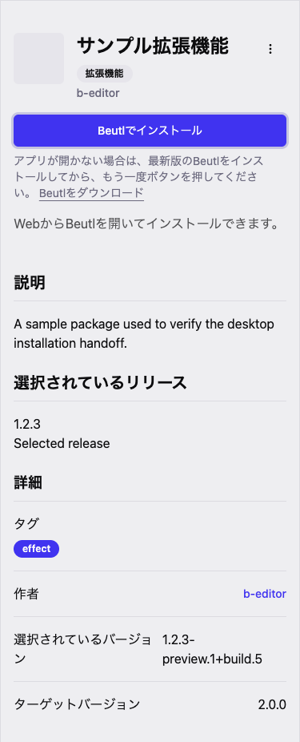

# Desktop installation links

An acquired package's store page offers **Install in Beutl**. The link opens the
desktop app's package details with the selected release. Installation is confirmed
inside Beutl. Acquisition, sign-in, and checkout still use the existing web flow.

The shared URL contract is:

```text
beutl://install?package=Beutl.Sample&version=1.2.3
```

`package` is the package name (not its database ID). Query values are URL-encoded;
in particular, build metadata's `+` must be encoded as `%2B`. The desktop accepts
an omitted `version` to select the latest public release. The web always sends the
selected published release and disables the button when that release is absent.

Use a regular link so the browser handles its external-app confirmation directly
from the user's click or keyboard action. Do not launch from a mount effect or
infer success from a timer. The fallback links to the same releases page used by
the landing page.

The Japanese store page after requesting a launch (headless browser, fixture data):



This requires the matching desktop changes in `beutl`: macOS bundle URL types,
Windows installer protocol registration, Linux desktop entries, and the package
link handler. Existing desktop releases without these registrations cannot open
the link. Release the desktop support before enabling the web button in production.

Verify the installed release with the app both closed and already running, select
an older version on the web, and confirm that Beutl displays that exact version
without starting a download until the desktop Install button is pressed. Also
check the fallback on a machine without Beutl and cancellation of the browser's
external-app prompt.
